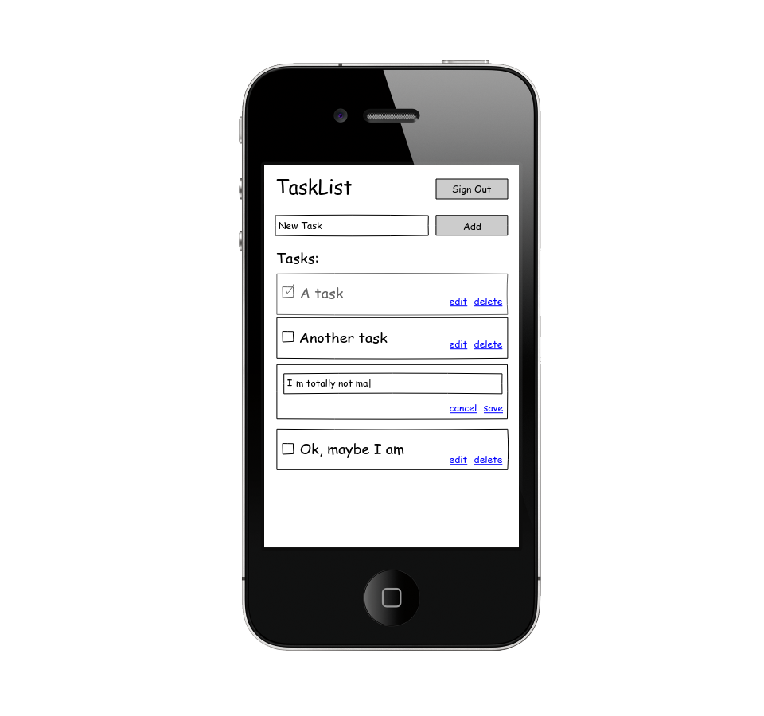

# Task List App

Ya antes hiciste un Trello donde podías añadir y quitar tareas de una lista. ¿Recuerdas como tuviste que manejar todos los cambios de la lista a mano? Bueno pues ahora con ReactJs puedes utilizar el poder de ésta biblioteca para que los cambios en la lista se vean reflejados automáticamente. No solo eso, aprenderás a separar los datos de la representación visual de la misma, facilitando su manejo de formas alternativas. Como por ejemplo, guardar los datos directamente en la base de datos en tiempo real [Firebase](https://firebase.google.com/).

**Duración:** Para este reto tendrás 2 días en tiempo de clase donde deberás explotar a tus coaches para resolver todas tus dudas, solucionar bugs y aprender todo lo que puedas, así como un fin de semana completo para entregar ese extra que distinga tu producto.
 
Temas a ver en este projecto:

- JSX
- Componentes
- Estado Global(sin Redux)
- create-app
- Firebase (realtime database)
- Deployment
    - [gh-pages](https://www.youtube.com/watch?v=7yA7BGos2KQ)
    - [Firebase](https://firebase.google.com/docs/hosting/deploying)
    - [Heroku](https://devcenter.heroku.com/articles/getting-started-with-nodejs)
    - [JASF(Just a Simple Folder)](https://neocities.org/)

## Alcances

### Versión 0.1: Funcionalidad básica.
Tu aplicación deberá de constar de un `input`, un botón de **_add_** y una lista de tareas. Al dar click en agregar se deberá de añadir la tarea en el tope de la lista, estas tareas deberan de quedar almacenadas persistentemente Firebase.

#### Versión 0.1.1: Un toque de UX.
Módifica tu código para que al dar `Enter`, se añada la nueva tarea cual si fuera un click en **_add_**, asegurate de volver el foco sobre el mismo `input` y limpiar el campo, para que el usuario avanzado pueda añadir varias tareas de forma consecutiva.

### Versión 0.2: Check!
Marca las tareas realizadas con un check, asegurate de guardar el nuevo estado en Firebase.

### Versión 0.3: Limpieza
Añade un enlace **_delete_** para eliminar las tareas.

### Versión 0.4: Edición
- Al hacer click en **_edit_** se deberá de reemplazar la representación de solo lectura de la tarea, por una versión de edición.
- Al dar click en **_save_** se deberá de guardar la nueva versión
- Al dar click en **_cancel_** se deberá de cancelar la edición y volver a su estado anterior.

### Versión 1: Usuarios
Hasta el momento seguramente almacenaste los datos en una lista general, modifica tu producto para permitir **_login_** y guardar las cosas por hacer de cada usuario de forma independiente.

- Login.
- Registro de cuenta nueva.
- Almacenar la lista de cada usuario de forma independiente.
- Logout.

### Versión 1.1: Drag and Drop
Un último toque de usabilidad, permite a tu usuario reordenar las tareas por hacer usando Drag and Drop

