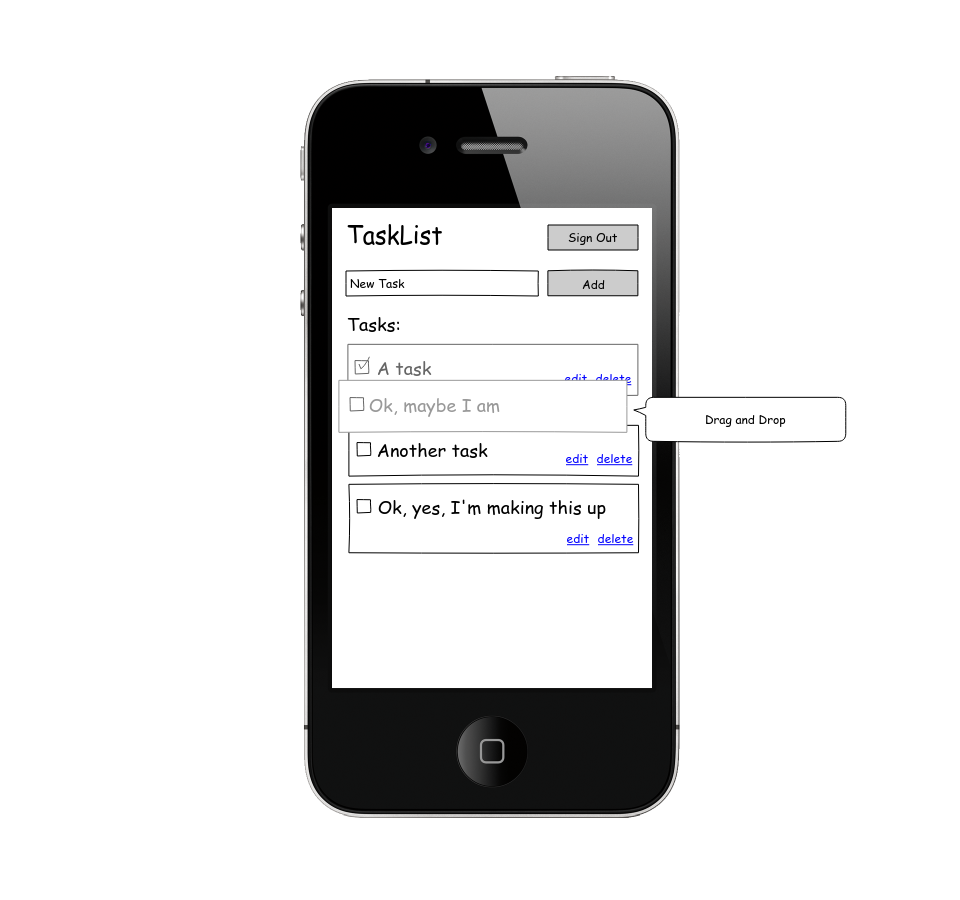

# Task List App

Ya antes hiciste un Trello donde podías añadir y quitar tareas de una lista. ¿Recuerdas como tuviste que manejar todos los cambios de la lista a mano? Bueno pues ahora con [ReactJs](https://reactjs.org/) puedes utilizar el poder de ésta biblioteca para que los cambios en la lista se vean reflejados automáticamente. No solo eso, aprenderás a separar los datos de la representación visual de la misma, facilitando su manejo de formas alternativas. Como por ejemplo, guardar los datos directamente en la base de datos en tiempo real [Firebase](https://firebase.google.com/).


**Duración:** Para este reto tendrás 2 días en tiempo de clase donde deberás explotar a tus coaches para resolver todas tus dudas, solucionar bugs y aprender todo lo que puedas, así como un fin de semana completo para entregar ese extra que distinga tu producto.
 
Temas a explorarás en este proyecto:

- JSX
- Componentes
- Estado Global (sin Redux)
- create-app
- Firebase (Realtime Database)
- Deployment
    - [gh-pages](https://www.youtube.com/watch?v=7yA7BGos2KQ)
    - [Firebase](https://firebase.google.com/docs/hosting/deploying)
    - [Heroku](https://devcenter.heroku.com/articles/getting-started-with-nodejs)
    - [JASF(Just a Simple Folder)](https://neocities.org/)

## Alcances sugeridos
A continuación te presentamos una sugerencia de como llevar tu reto, cada una de estas versiones está diseñada para **mejorar la usabilidad del producto y crear una experiencia completa para tu usuario**, así mismo **te forzará a completar retos importantes en tu aprendizaje**, no permitas que los posibles bloqueos te detengan, cada uno de ellos es una oportunidad de aprender algo nuevo.

**¡Platica con tus compañeras, coaches y la comunidad de laboratoria en slack para superarlos!**.

### Versión 0.1: Usuarios


Te sugerimos comenzar creando un _login_ con [Firebase](https://firebase.google.com/) y [React](https://reactjs.org/), es mucho más sencillo de lo que parece y te permitirá almacenar las tareas por hacer individualmente para cada usuario.

- _Login_, _Logout_ y Registro de cuenta nueva.
- Almacenar las tareas por hacer de cada usuario de forma independiente.

Puedes encontrar como hacer el _login_ y registro con Firebase en el siguiente tutorial: [Getting started with Firebase Auth on the Web - Firecasts](https://www.youtube.com/watch?v=-OKrloDzGpU&vl=en).

Una vez que el usuario haya hecho _login_ desearás mostrar la lista de tareas y no el formulario de _login_, en [Conditional Rendering](https://reactjs.org/docs/conditional-rendering.html) encontrarás las pistas para eso.

### Versión 0.2: Funcionalidad básica.


> Ten siempre en cuenta el articulo en [Thinking In React](https://reactjs.org/docs/thinking-in-react.html) mientras desarrollas, te ahorrará mucho trabajo y evitará problemas a futuro.

Tu aplicación deberá de constar de un `input`, un botón de **_add_** y una lista de tareas por hacer. Al dar _click_ en **_add_** se deberá de añadir la tarea en el tope de la lista, **tal vez te parezca complejo hacer esto con React, pero no temas, es un ejemplo tan común que encontrarás miles de ejemplos en Internet donde comenzar**, el más sencillo y directo está en [la página de inicio de ReactJS.org](https://reactjs.org/)

Por supuesto no servirá de mucho solo mostrar las tareas y que se pierdan a recargar la página, para almacenarlas persistentemente puedes seguir estos tutoriales oficiales de Firebase:

- [Getting Started with the Firebase Realtime Database on the Web, Part 1](https://www.youtube.com/watch?v=noB98K6A0TY)
- [Getting Started with the Firebase Realtime Database on the Web, Part 2](https://www.youtube.com/watch?v=dBscwaqNPuk)

Te sugerimos seguir una estructura similar a esta para poder manejar todos los requerimientos sugeridos sin que tengas problemas.:

```json
"userid1": {
	"-pXQX5ZykpETZcB8H": {
		"order": 1,
		"done": false,
		"text": "Pick up the milk"
	},
	"-7r7V2h8hVAs2YhMm": {
		"order": 2,
		"done": true,
		"text": "Conquest the world"
	},
	"-Vuc4wHMZvbfcddPk": {
		"order": 3,
		"done": false,
		"text": "Binge watch Luis Miguel"
	},
},
"userid2": {
	"-YzrEzH2PMe7QyMM4": {
		"order": 1,
		"done": false,
		"text": "End world poverty"
	},
	"-mT9R3xxP87e8qNtw": {
		"order": 2,
		"done": true,
		"text": "Revive Freddy Mercury"
	},
	"-byr6EZwpRyABBM8G": {
		"order": 3,
		"done": false,
		"text": "Bringback disco"
	},
}
```
> Las cadenas tipo "-pXQX5ZykpETZcB8H" usadas como llave se crean automáticamente al crear un nuevo elemento siguiendo las instrucciones de [Append to a list of data](https://firebase.google.com/docs/database/web/lists-of-data#append_to_a_list_of_data) en la documentación oficial.

#### Versión 0.2.1: Un toque de UX.


Modifica tu código para que al dar `Enter` se añada la nueva tarea cual si fuera un _click_ en **_add_**, asegurate de volver el foco sobre el mismo `input` y limpiar el campo, para que el usuario avanzado pueda añadir varias tareas de forma consecutiva.


### Versión 0.3: Check!


Marca las tareas realizadas con un _check_. **¡Asegurate de guardar el nuevo estado en _Firebase_!**.


### Versión 0.4: Limpieza


Añade un enlace **_delete_** para eliminar las tareas.

### Versión 1: Edición


¿Sabias que un componente puede mostrarse de una forma u otra dependiendo de en que estado este? claro que sí, lo viste cuando hiciste el _login_. Vuelve a revisar [Conditional Rendering](https://reactjs.org/docs/conditional-rendering.html) para adaptarlo a este caso.

- Al hacer click en **_edit_** se deberá de reemplazar la representación de solo lectura de la tarea, por una versión de edición.
- Al dar click en **_save_** se deberá de guardar la nueva versión
- Al dar click en **_cancel_** se deberá de cancelar la edición y volver a su estado anterior.

### Versión 1.1: Drag and Drop



Un último toque de usabilidad, permite a tu usuario reordenar las tareas por hacer usando Drag and Drop

## Estrategias de desarrollo
Ten siempre en cuenta el articulo en [Thinking In React](https://reactjs.org/docs/thinking-in-react.html) mientras desarrollas, te ahorrará mucho trabajo y evitará problemas a futuro.

## Deployment
React tiene un sistema de building que genera una carpeta lista para subir a cualquier hosting como [gh-pages](https://www.youtube.com/watch?v=7yA7BGos2KQ), [Firebase](https://firebase.google.com/docs/hosting/deploying), [Heroku](https://devcenter.heroku.com/articles/getting-started-with-nodejs) o [JASF(Just a Simple Folder)](https://neocities.org/), ¡Elige tu hosting y publica tu producto!
